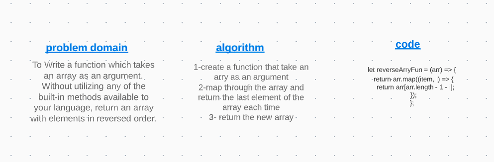

# Reverse an Array

Write a function called reverseArray which takes an array as an argument. Without utilizing any of the built-in methods available to your language, return an array with elements in reversed order.

## Challenge

to reverse a given array elements order without using any build in commands

## Approach & Efficiency

I used the map method because it returns a new array with the same array length, I utilized the index parameter to call the last index of the array firstly, hence return it.

