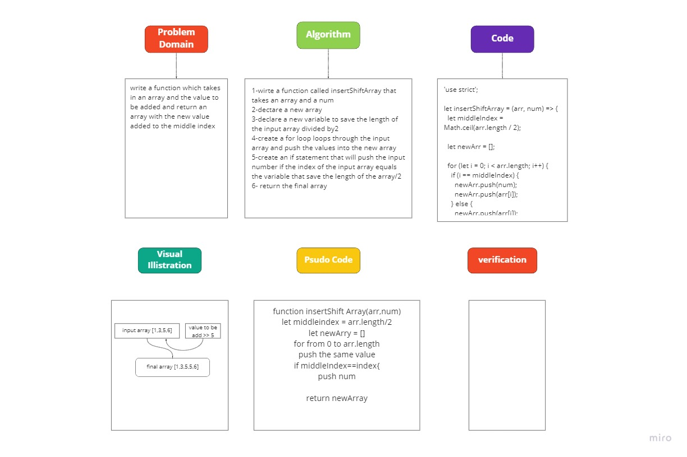

# Challenge Summary

write a function which takes in an array and the value to be added and return an array with the new value added to the middle index.

## Challenge Description

write a function which takes in an array and the value to be added and return an array with the new value added to the middle index.

## Approach & Efficiency

A simple and basic approach utilizing a for loop and if statement

## Solution

