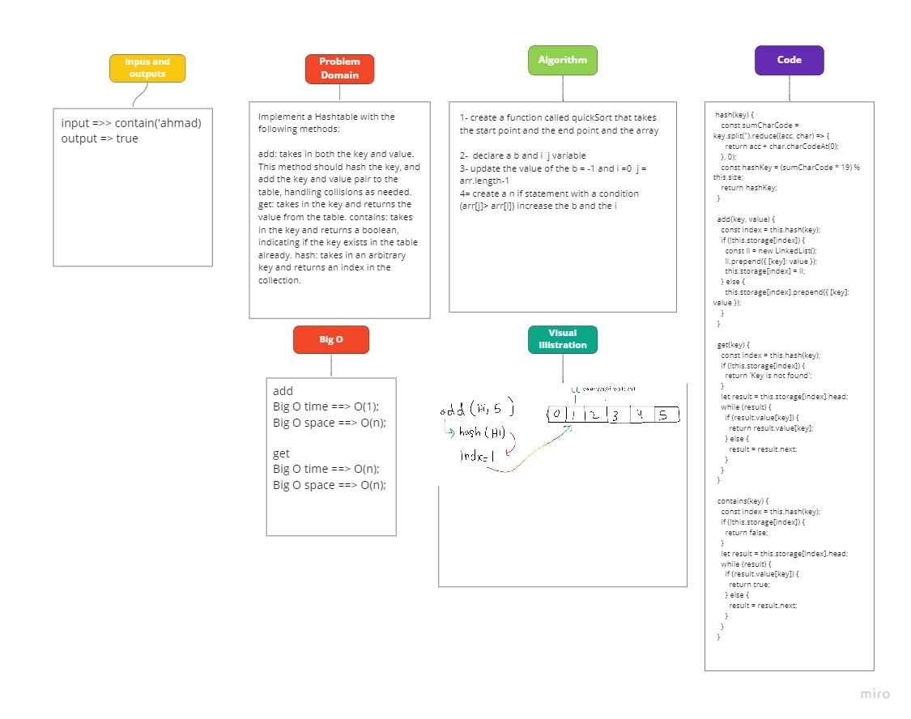

# Hash Tables

## Challenge

Implement a Hashtable with the following methods:

add: takes in both the key and value. This method should hash the key, and add the key and value pair to the table, handling collisions as needed. get: takes in the key and returns the value from the table. contains: takes in the key and returns a boolean, indicating if the key exists in the table already. hash: takes in an arbitrary key and returns an index in the collection.

## Approach & Efficiency

Utilize the Single-responsibility principle: any methods you write should be clean, reusable, abstract component parts to the whole challenge. You will be given feedback and marked down if you attempt to define a large, complex algorithm in one function definition.

