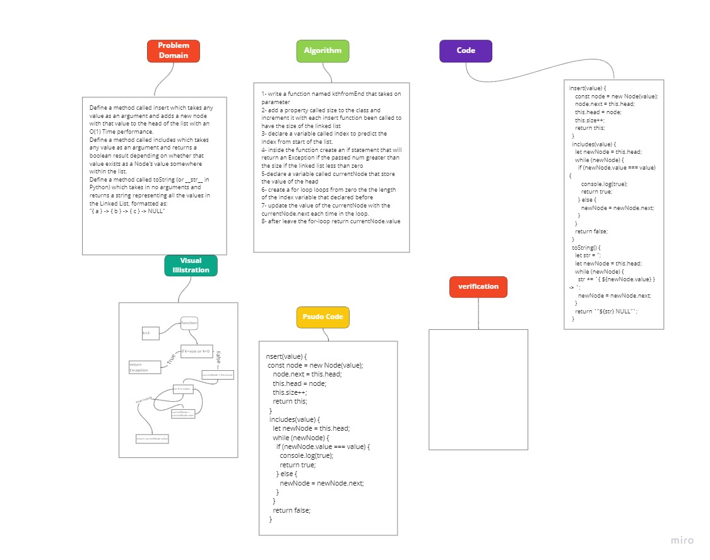
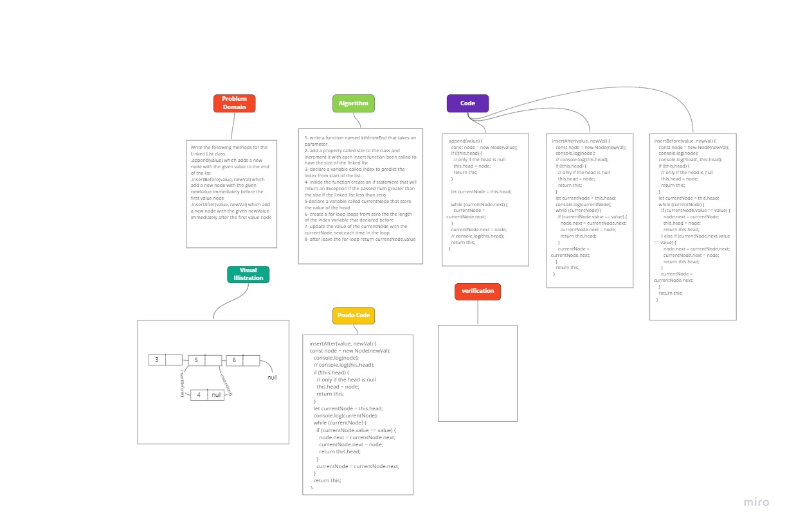

# Linked list Singly Linked Lists.

Define a method called insert which takes any value as an argument and adds a new node with that value to the head of the list with an O(1) Time performance.

Define a method called includes which takes any value as an argument and returns a boolean result depending on whether that value exists as a Node’s value somewhere within the list.

Define a method called toString (or **str** in Python) which takes in no arguments and returns a string representing all the values in the Linked List, formatted as:

"{ a } -> { b } -> { c } -> NULL"

## Challenge

To adds a new node with that value to the head of the list with an O(1) Time performance.

## Approach & Efficiency

I used a counter that return the size of the linked list it self to utilize it in predicting the value of the desired index

# Append(), insertAfter(), insertBefore()

.append(value) which adds a new node with the given value to the end of the list
.insertBefore(value, newVal) which add a new node with the given newValue immediately before the first value node
.insertAfter(value, newVal) which add a new node with the given newValue immediately after the first value node

## Challenge

write three function for insert a new node either at the head oe tale or between existing nodes.

## Approach & Efficiency

