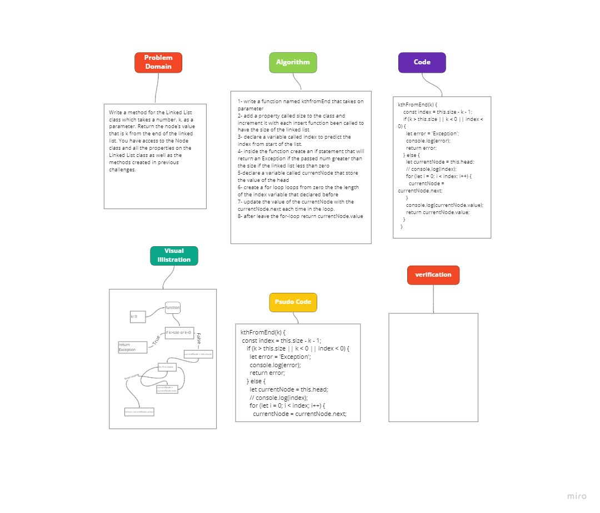

# Linked list k-th value from the end of a linked list.

Write a method for the Linked List class which takes a number, k, as a parameter. Return the node’s value that is k from the end of the linked list. You have access to the Node class and all the properties on the Linked List class as well as the methods created in previous challenges.

## Challenge

To find the value of the k-th index from the last of the linked list

## Approach & Efficiency

I used a counter that return the size of the linked list it self to utilize it in predicting the value of the desired index

